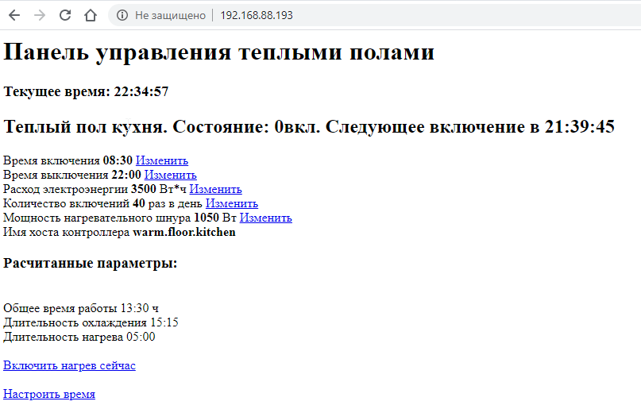

Прошивка серверной части контроллера теплого пола для esp32. В качестве клиента выступает shelly1 (https://shelly.cloud/shelly1-open-source/). Коммуникация происходит по REST API модуля shelly1.
Запрос на включение обогрева включает в себя время работы, чтобы исключить перегрев нагревателя в случае сбоя серверного контроллера.

Позволяет контролировать непосредственно расход электроэнергии нагревателем теплого пола, в отличие от большинства промышленных контроллеров, работающих по обратной связи.

В качестве модуля часов используется RTC DS3231.